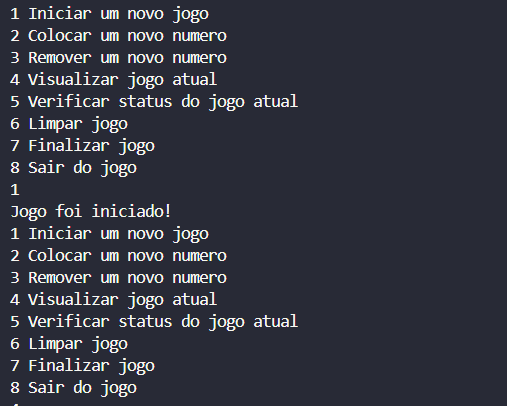
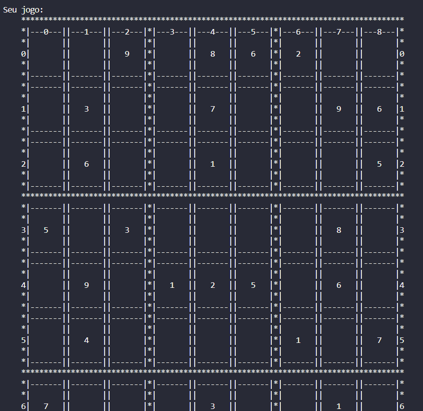
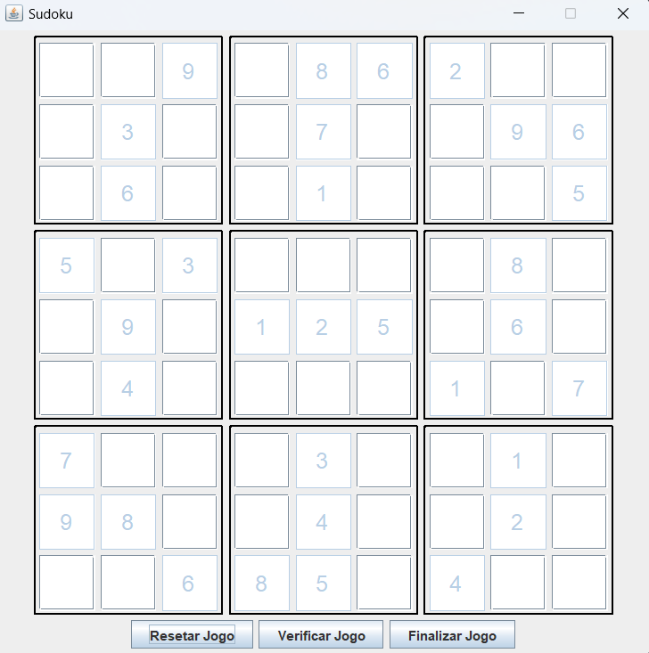
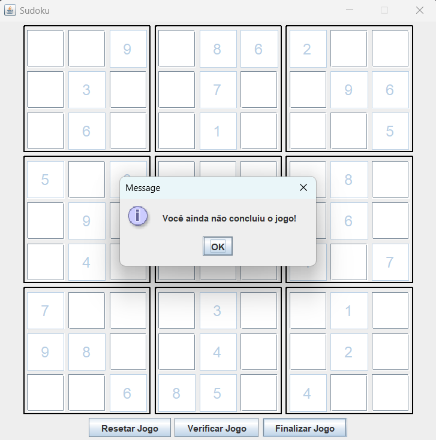
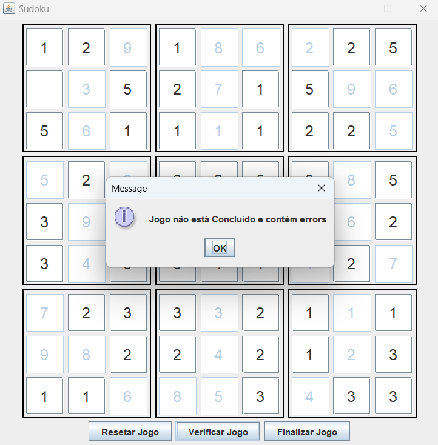
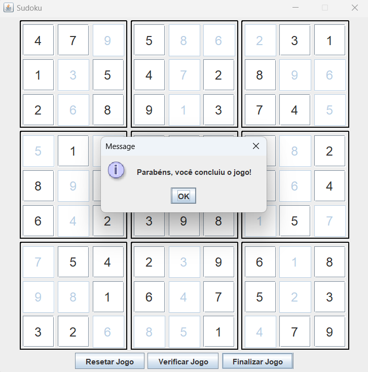
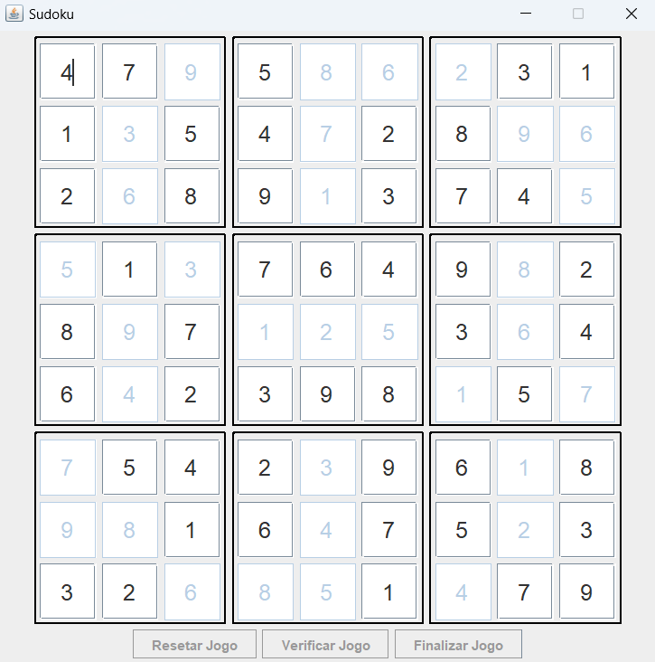
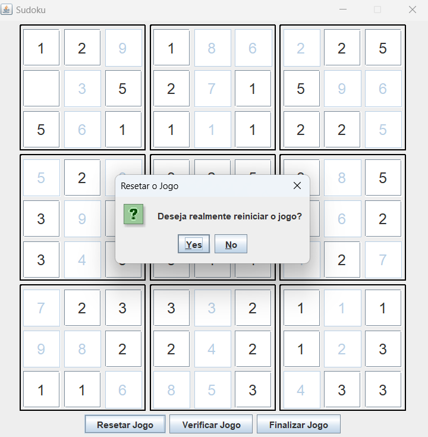

# 🧩 DioSudoku

<p align="center">
  
  
  
  
  
</p>

<div align="center">
  <b>🇧🇷 Português | <a href="#english-version">🇺🇸 English below</a></b>
</div>

---

## 📑 Sumário | Table of Contents
- [Sobre o Projeto | About](#sobre-o-projeto--about)
- [Funcionalidades | Features](#funcionalidades--features)
- [Tecnologias | Technologies](#tecnologias--technologies)
- [Estrutura do Projeto | Project Structure](#estrutura-do-projeto--project-structure)
- [Interfaces | Interfaces](#interfaces--interfaces)
- [Configuração e Execução | Setup & Run](#configuração-e-execução--setup--run)
- [Como Jogar | How to Play](#como-jogar--how-to-play)
- [Autor | Author](#autor--author)

---

## Sobre o Projeto | About

**PT-BR:**
> Um jogo de Sudoku completo desenvolvido em Java com duas interfaces: console (CLI) e gráfica (Swing). O projeto implementa arquitetura orientada a eventos, padrão MVC e validação em tempo real do tabuleiro. Ideal para estudos de programação orientada a objetos, interfaces gráficas e lógica de jogos.

**EN:**
> A complete Sudoku game developed in Java with two interfaces: console (CLI) and graphical (Swing). The project implements event-driven architecture, MVC pattern, and real-time board validation. Ideal for studying object-oriented programming, graphical interfaces, and game logic.

---

## 🎮 Funcionalidades | Features

### **PT-BR:**
- **Duas Interfaces**: Console (CLI) e Gráfica (Swing)
- **Validação em Tempo Real**: Verificação automática de erros
- **Múltiplos Estados do Jogo**: Não iniciado, Incompleto, Completo
- **Sistema de Eventos**: Arquitetura orientada a eventos para comunicação entre componentes
- **Persistência de Dados**: Configuração do tabuleiro via argumentos de linha de comando
- **Interface Responsiva**: Design moderno com componentes Swing customizados
- **Validação de Entrada**: Restrição de entrada apenas para números válidos (1-9)
- **Botões de Controle**: Reset, Verificar Status, Finalizar Jogo

### **EN:**
- **Two Interfaces**: Console (CLI) and Graphical (Swing)
- **Real-time Validation**: Automatic error checking
- **Multiple Game States**: Not Started, Incomplete, Complete
- **Event System**: Event-driven architecture for component communication
- **Data Persistence**: Board configuration via command line arguments
- **Responsive Interface**: Modern design with custom Swing components
- **Input Validation**: Restriction to valid numbers only (1-9)
- **Control Buttons**: Reset, Check Status, Finish Game

---

## 🚀 Tecnologias | Technologies

**PT-BR:**
- **Java 17+**: Linguagem principal do projeto
- **Swing**: Framework para interface gráfica
- **AWT**: Componentes básicos de interface
- **Event-Driven Architecture**: Sistema de eventos customizado
- **MVC Pattern**: Separação de responsabilidades (Model-View-Controller)
- **Stream API**: Processamento funcional de dados

**EN:**
- **Java 17+**: Main project language
- **Swing**: Framework for graphical interface
- **AWT**: Basic interface components
- **Event-Driven Architecture**: Custom event system
- **MVC Pattern**: Separation of concerns (Model-View-Controller)
- **Stream API**: Functional data processing

---

## 🗂️ Estrutura do Projeto | Project Structure

```
dioSudoku/
├── src/
│   ├── App.java                    # Interface Console (CLI)
│   ├── UIMain.java                 # Interface Gráfica (Swing)
│   └── br/com/dio/
│       ├── model/                  # Modelos de Dados
│       │   ├── Board.java          # Tabuleiro do Sudoku
│       │   ├── Space.java          # Célula individual
│       │   └── GameStatusEnum.java # Estados do jogo
│       ├── service/                # Lógica de Negócio
│       │   ├── BoardService.java   # Serviço do tabuleiro
│       │   ├── NotifierService.java # Sistema de eventos
│       │   ├── EventEnum.java      # Tipos de eventos
│       │   └── EventListener.java  # Interface de listener
│       ├── ui/custom/              # Componentes de Interface
│       │   ├── button/             # Botões customizados
│       │   ├── frame/              # Janelas
│       │   ├── input/              # Campos de entrada
│       │   ├── panel/              # Painéis
│       │   └── screen/             # Telas principais
│       └── util/                   # Utilitários
│           └── BoardTemplate.java  # Template do tabuleiro
├── bin/                            # Arquivos compilados
└── README.md
```

---

## 🖥️ Interfaces | Interfaces

### **Screenshots | Capturas de Tela**

**PT-BR | EN:**
<div align="center">
  <h4>Interface Console | Console Interface (CLI)</h4>
  
  
  
  <h4>Interface Gráfica | Graphical Interface (Swing)</h4>
  
  
  
  
  
  
</div>

### **Interface Console | Console Interface (CLI)**
**PT-BR:**
- Menu interativo com 8 opções:
  1. **Iniciar um novo jogo** - Cria um novo tabuleiro de Sudoku
  2. **Colocar um novo numero** - Insere um número em uma posição específica
  3. **Remover um novo numero** - Remove um número de uma posição
  4. **Visualizar jogo atual** - Mostra o estado atual do tabuleiro
  5. **Verificar status do jogo atual** - Verifica se há erros e o progresso
  6. **Limpar jogo** - Reseta o tabuleiro (com confirmação)
  7. **Finalizar jogo** - Verifica se o jogo foi completado corretamente
  8. **Sair do jogo** - Encerra a aplicação
- Entrada via Scanner com validação
- Visualização do tabuleiro em ASCII com template personalizado
- Validação de entrada em tempo real
- Confirmação para ações destrutivas

**EN:**
- Interactive menu with 8 options:
  1. **Start a new game** - Creates a new Sudoku board
  2. **Place a new number** - Inserts a number in a specific position
  3. **Remove a number** - Removes a number from a position
  4. **View current game** - Shows the current state of the board
  5. **Check current game status** - Checks for errors and progress
  6. **Clear game** - Resets the board (with confirmation)
  7. **Finish game** - Verifies if the game was completed correctly
  8. **Exit game** - Closes the application
- Scanner-based input with validation
- ASCII board visualization with custom template
- Real-time input validation
- Confirmation for destructive actions

### **Interface Gráfica | Graphical Interface (GUI)**
**PT-BR:**
- Interface gráfica moderna (600x600px)
- 9 setores de 3x3 células
- Campos de entrada restritos (1-9)
- Botões de controle integrados
- Feedback visual de erros

**EN:**
- Modern graphical interface (600x600px)
- 9 sectors of 3x3 cells
- Restricted input fields (1-9)
- Integrated control buttons
- Visual error feedback

---

## ⚙️ Configuração e Execução | Setup & Run

### **Pré-requisitos | Prerequisites**
- Java 17 ou superior
- Compilador Java (javac)

### **Compilação | Compilation**
```bash
# Compilar todos os arquivos
javac -d bin src/**/*.java src/*.java
```

### **Execução | Execution**

#### **Interface Console (CLI)**
```bash
# Executar com configuração padrão
java -cp bin App

# Executar com configuração customizada
java -cp bin App "0,0=5,true" "0,1=3,false" "0,2=,false"
```

#### **Interface Gráfica (Swing)**
```bash
# Executar interface gráfica
java -cp bin UIMain

# Executar com configuração customizada
java -cp bin UIMain "0,0=5,true" "0,1=3,false" "0,2=,false"
```

### **Formato de Configuração | Configuration Format**
```
"coluna,linha=valor,fixo"
```
- **coluna,linha**: Posição no tabuleiro (0-8)
- **valor**: Número do Sudoku (1-9) ou vazio
- **fixo**: true (não pode ser alterado) ou false (editável)

---

## 🎯 Como Jogar | How to Play

### **PT-BR:**
1. **Iniciar Jogo**: Escolha a opção 1 no console ou use a interface gráfica
2. **Preencher Números**: Digite números de 1 a 9 nas células vazias
3. **Validação**: O sistema verifica automaticamente se há erros
4. **Verificar Status**: Use o botão "Verificar Status" para ver o progresso
5. **Finalizar**: Complete todas as células corretamente para vencer

### **EN:**
1. **Start Game**: Choose option 1 in console or use graphical interface
2. **Fill Numbers**: Enter numbers 1-9 in empty cells
3. **Validation**: System automatically checks for errors
4. **Check Status**: Use "Check Status" button to see progress
5. **Finish**: Complete all cells correctly to win

---

## 👨‍💻 Autor | Author

**PT-BR:**

<div align="center">

**Rodolfo M. F. Abreu**  
Desenvolvedor de software apaixonado por tecnologia, aprendizado contínuo e boas práticas de programação. Sempre em busca de novos desafios e oportunidades para colaborar em projetos inovadores.

[](https://github.com/salamandery)
[](https://linkedin.com/in/rodolfo-marques-ferreira-de-abreu/)

Sinta-se à vontade para entrar em contato para dúvidas, sugestões ou colaborações!

</div>

**EN:**

<div align="center">

**Rodolfo M. F. Abreu**  
Software developer passionate about technology, continuous learning, and best programming practices. Always looking for new challenges and opportunities to collaborate on innovative projects.

[](https://github.com/salamandery)
[](https://linkedin.com/in/rodolfo-marques-ferreira-de-abreu/)

Feel free to get in touch for questions, suggestions, or collaborations!

</div>

---

<div align="center">
  <b>Feito com 💙 para estudos de Java, Swing, arquitetura de software e desenvolvimento de jogos.<br/>
  Made with 💙 for Java, Swing, software architecture and game development studies.</b>
</div>

---

<div align="center" id="english-version">
  <b>🇺🇸 English version above | <a href="#top">🇧🇷 Versão em português acima</a></b>
</div>